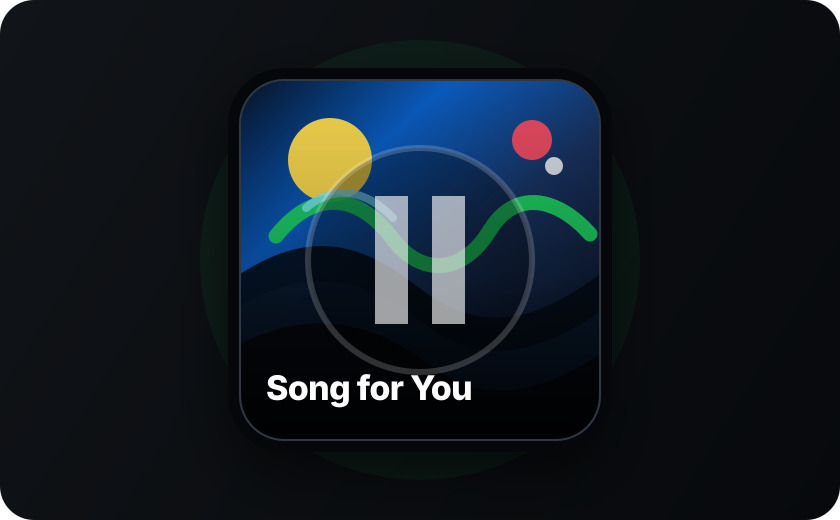
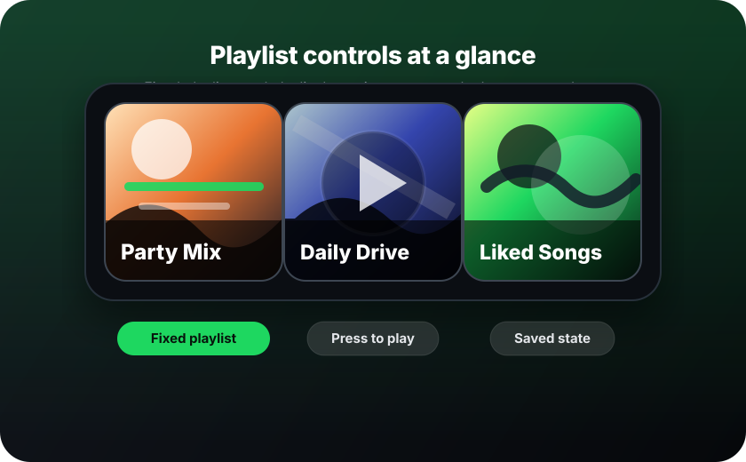

<p align="center">
  
</p>

<h1 align="center">Spotify Enhanced for Ulanzi D200</h1>

<p align="center">
  <strong>Turn your Ulanzi D200 into a compact Spotify controller with artwork, track text, playlists, volume and library controls.</strong>
</p>

<p align="center">
  
  
  
  
</p>

---

## Visual Preview

| Now Playing                                                                                                                                       | Playlist Controls                                                                                                                 |
| ------------------------------------------------------------------------------------------------------------------------------------------------- | --------------------------------------------------------------------------------------------------------------------------------- |
|                |  |
| Play/Pause mirrors the plugin render: album artwork fills the button, a large pause icon appears while playing, and only the song title is shown. | Playlist actions can show playlist artwork, saved/playing/paused state and provide quick access to fixed or browsable playlists.  |

## Overview

Spotify Enhanced is a public Ulanzi plugin package for Spotify playback control. It focuses on making Spotify actions understandable at a glance: active playback uses artwork and text, playlist buttons can show playlist identity and state, and the settings panel includes a local setup guide so users do not need to visit an external documentation site.

This repository contains the final `com.buzs.spotify.ulanziPlugin` folder for store/community review. It does not include the private TypeScript source code.

Spotify Enhanced is not affiliated with, endorsed by, or sponsored by Spotify. Spotify trademarks and branding belong to Spotify AB.

## Highlights

| Feature                  | What it gives you                                                                                              |
| ------------------------ | -------------------------------------------------------------------------------------------------------------- |
| Now Playing render       | Play/Pause can show album artwork, a large pause overlay and the current song title instead of a static icon.  |
| Fixed playlist button    | Pick a playlist once, then use one button to play or pause it. The button can show playlist artwork and state. |
| Playlist browser         | Use the encoder to rotate through your Spotify playlists and press to play the selected one.                   |
| Encoder playback control | Press for play/pause, rotate for previous/next track.                                                          |
| Encoder volume control   | Press to mute, rotate to adjust volume by a configurable step.                                                 |
| Local setup guide        | The Spotify Developer App guide is bundled with the plugin and opens from the settings panel.                  |
| Multi-account support    | Add more than one Spotify account and choose which one an action should use.                                   |
| Safer local storage      | Access tokens, refresh tokens and Client Secret are stored locally with AES-256-GCM encryption.                |

## Actions

| Action            | Controller | What it does                                                                              |
| ----------------- | ---------- | ----------------------------------------------------------------------------------------- |
| Play/Pause        | Keypad     | Toggles playback on the selected or active Spotify device and can show the current track. |
| Previous Track    | Keypad     | Plays the previous track.                                                                 |
| Next Track        | Keypad     | Skips to the next track.                                                                  |
| Toggle Shuffle    | Keypad     | Toggles Spotify shuffle mode.                                                             |
| Toggle Repeat     | Keypad     | Cycles repeat between context, track and off.                                             |
| Mute Volume       | Keypad     | Toggles Spotify volume between muted and the last known volume.                           |
| Volume Set        | Keypad     | Sets volume to a configured percentage.                                                   |
| Volume Up         | Keypad     | Raises volume by 10 percent.                                                              |
| Volume Down       | Keypad     | Lowers volume by 10 percent.                                                              |
| Toggle Track Like | Keypad     | Adds or removes the current track from liked songs.                                       |
| Play Control      | Encoder    | Press to play/pause, rotate for previous/next.                                            |
| Volume Control    | Encoder    | Press to mute, rotate to adjust volume by a configured step.                              |
| My Playlists      | Encoder    | Rotate through playlists and press to play the selected playlist.                         |
| New Releases      | Encoder    | Rotate through Spotify new releases and press to play the selected album.                 |
| Play Playlist     | Keypad     | Plays or pauses a fixed playlist selected in the settings panel.                          |

## Requirements

- Ulanzi D200 with Ulanzi software 2.1.0 or newer.
- Windows 10 or newer, or macOS 10.11 or newer.
- Spotify account with Spotify Premium. Spotify Web API playback control requires Premium.
- Spotify desktop app, mobile app or web player open on at least one device.
- A Spotify Developer app created by the user.

## Install From Release

Download the ZIP asset from the latest GitHub Release:

```text
com.buzs.spotify.ulanziPlugin.zip
```

Import that ZIP in the Ulanzi software. End users do not need to run `npm install` for normal installation.

Do not install GitHub's automatically generated source code archives. Use the `.ulanziPlugin.zip` file attached to the release.

## Spotify Setup

The plugin includes a local multilingual setup guide. Open any Spotify Enhanced action settings panel and click `Open local guide` to view the instructions in a browser tab without relying on an external documentation site.

Default redirect URI:

```text
http://127.0.0.1:30901/oauth2callback
```

If the settings panel shows a different redirect URI, add the exact URI shown in the panel to your Spotify Developer app before clicking `Connect`. This only happens when port `30901` is already used by another local application.

Quick setup:

1. Open `https://developer.spotify.com/dashboard/` and sign in with your Spotify account.
2. Click `Create app`.
3. Use any app name and description.
4. Add the redirect URI shown above.
5. Select `Web API`.
6. Accept the Spotify terms and save the app.
7. Open the app settings and copy the `Client ID` and `Client Secret`.
8. In Ulanzi, open any Spotify Enhanced action settings panel and paste the credentials.
9. Click `Connect`, approve the Spotify authorization page and return to Ulanzi.

Do not share your Client Secret. If it leaks, rotate it in Spotify Developer Dashboard.

## Settings Panel

Open a Spotify Enhanced action settings panel to:

- Connect a Spotify account.
- Add another Spotify account.
- Disconnect the selected account.
- Open the bundled local setup guide.
- Choose the Spotify device or use the active device.
- Configure per-action options such as playlist, volume value and volume step.

## Privacy And Local Data

Spotify Enhanced stores account data inside the installed plugin folder:

```text
com.buzs.spotify.ulanziPlugin/.data/index.json
```

The file contains the local server port, an internal inspector token and encrypted Spotify credentials. Access tokens, refresh tokens and client secrets are encrypted with AES-256-GCM using a key derived from the local machine and plugin UUID.

The plugin communicates with Spotify Web API and `accounts.spotify.com`. It also starts a local HTTP server bound to `127.0.0.1` for OAuth and settings-panel communication.

## Troubleshooting

- `INVALID_CLIENT` or authorization fails: check that Client ID and Client Secret were copied from the same Spotify app.
- Redirect URI mismatch: add the exact redirect URI shown in the settings panel to Spotify Developer Dashboard.
- Playback actions do nothing: open Spotify on a device and start playback once, then try again.
- Device list is empty: make sure the Spotify app or web player is open and online.
- Volume/playback control fails: confirm the Spotify account has Premium.
- Account keeps failing: disconnect it in the settings panel, rotate the Client Secret in Spotify Developer Dashboard and connect again.

## Repository Layout

```text
.
├── CHANGELOG.md
├── LICENSE
├── README.md
├── docs/
│   └── images/
└── com.buzs.spotify.ulanziPlugin/
    ├── manifest.json
    ├── package.json
    ├── plugin/
    ├── property-inspectors/
    └── resources/
```

## License

Spotify Enhanced is distributed here as a built Ulanzi plugin package. The real source code is private and is not licensed as part of this public distribution.

Third-party components keep their own licenses. Spotify trademarks and branding belong to Spotify AB. Ulanzi SDK/runtime files belong to their respective owners.
